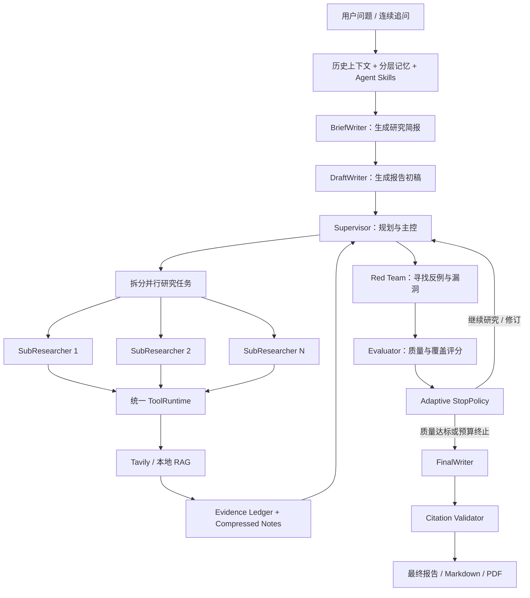
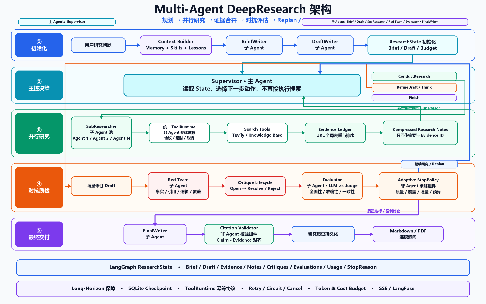
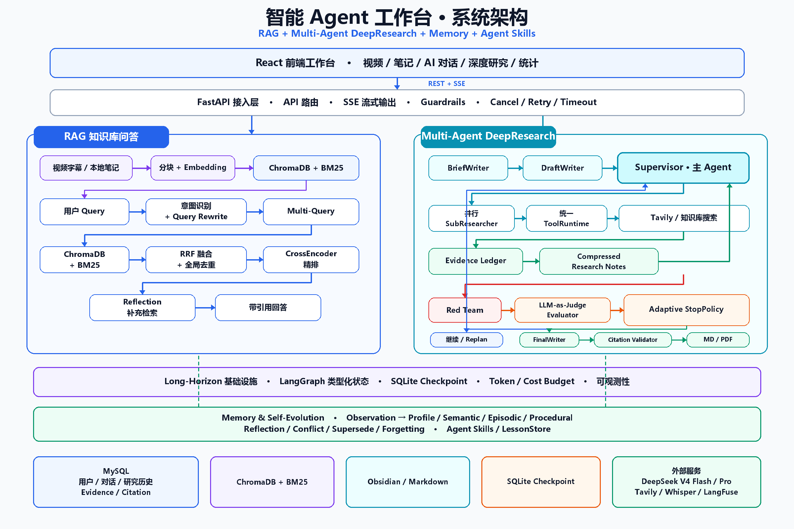

<div align="center">

# 🧭 知研 Agent

### 知识库与深度研究 Agent

面向复杂研究任务的 AI Agent 应用：统一承载邮箱身份认证、内容采集、RAG 对话、长周期 DeepResearch、结构化证据校验与分层记忆。


**不是简单的聊天套壳，而是一套可规划、可检索、可验证、可恢复的多智能体研究系统。**

</div>

---

## 🎯 项目介绍

知研 Agent 是一个以前端工作台为入口、FastAPI 为接入层、RAG 与 DeepResearch 为业务核心的多智能体应用。

系统既可以把视频和本地文档转化为可检索内容，也可以针对开放问题执行长周期研究：由 Supervisor 拆解任务，调度多个 SubResearcher 并行检索，使用结构化 Evidence 约束报告生成，再通过 Red Team、Evaluator 和 Citation Validator 完成对抗审查与引用校验。

系统内置邮箱注册、验证码验证、登录与密码找回，使用短期 Access Token、可轮换 Refresh Token 与 HttpOnly Cookie 维护会话。视频、笔记、向量索引、聊天、记忆、研究历史和 Checkpoint 均按登录用户隔离；管理员可以管理账户状态、角色和登录会话。

当前前端包含六个工作区：

| 工作区 | 主要能力 |
|---|---|
| 添加视频 | 处理 YouTube、Bilibili 及 yt-dlp 支持的视频链接，字幕缺失时使用 Whisper 兜底 |
| 导入笔记 | 导入 Markdown、PDF、TXT、DOCX 等本地文档 |
| 笔记 | 浏览和编辑已处理的视频笔记与导入内容 |
| AI 对话 | 基于本地内容进行混合检索、流式回答和引用展示 |
| 深度研究 | 多 Agent 联网研究、连续追问、历史会话、停止研究和报告导出 |
| 统计 | 展示内容规模、分类、标签与评测信息 |

> README 以当前代码和产品界面为准，只描述现阶段可见、可运行的能力，不再把已经从导航下线的实验页面作为主功能展示。

---

## ✨ 核心亮点

### 1. Supervisor 驱动的长周期研究

- Supervisor 是 DeepResearch 主 Agent，负责拆解目标、派发子任务、控制预算、修订报告和决定停止。
- 15 轮是研究循环的硬上限，不要求每次跑满。
- StopPolicy 会综合质量分、证据覆盖率、评分停滞、连续无新证据、未解决高风险 Critique 和预算状态提前结束。
- 每轮研究状态显式写入 `ResearchState`，避免只依赖不断增长的对话消息。

### 2. 结构化 Evidence 与正文级引用

- 每条来源保存稳定 `source_id`、URL、标题、搜索 Query、摘要、发布时间、来源类型、权威度和新鲜度。
- Evidence Ledger 按规范化 URL 在整个 Research Run 内全局去重，并合并不同 Query 对同一来源的发现。
- Citation Validator 检查关键 Claim 是否由本轮 Evidence 支撑，同时移除模型生成但不在证据集中的链接。
- 最终引用直接出现在报告正文中，用户可以点击来源进行 double check。

### 3. 对抗评估与自动修订

- Red Team 基于真实 Evidence 检查事实错误、引用缺失、逻辑漏洞和研究覆盖不足。
- Evaluator 对全面性、准确性、一致性和证据覆盖率进行结构化评分。
- Supervisor 根据 Critique 和评分选择继续搜索、修订草稿、重新规划或结束研究。
- 高严重度 Critique 未解决时，StopPolicy 不允许正常完成。

### 4. LangGraph Checkpoint 恢复

- Brief、Draft、Evidence、ResearchNote、Critique、Evaluation、Usage 和 StopReason 都保存在类型化状态中。
- `run_id` 同时作为 LangGraph `thread_id`，状态写入 SQLite Checkpoint。
- 服务中断后，使用相同 `run_id` 可以从最近一个未完成节点继续，而不是从头重新搜索。
- Checkpoint 恢复的是工作流状态，不是已经中断的单次 HTTP 请求。

### 5. 分层记忆系统

- 原始聊天和工具结果先作为 Observation，经过选择后才编码为长期 Memory Fact。
- 长期记忆划分为 Profile、Semantic、Episodic 和 Procedural，不把所有历史直接塞进 Prompt。
- 检索综合语义相关性、任务作用域、重要性、置信度、时间衰减和历史使用效果。
- 新旧偏好冲突时支持版本化、自动 supersede 或进入冲突队列。
- Reflection 将多条 Observation 提炼为稳定事实和可复用经验；普通观察和推断记忆支持 TTL 与遗忘。

### 6. 面向长网页的上下文工程

```text
搜索结果
  → Query / URL 全局去重
  → 来源质量排序（权威度 65% + 新鲜度 35%）
  → 网页正文有界摘要
  → SubResearcher 独立 ReAct 上下文
  → 子任务轨迹二次压缩
  → Supervisor 消费压缩笔记 + Evidence Ledger
  → Red Team / Evaluator / Citation Validator
```

Supervisor 不直接读取所有网页全文。网页先在工具层压缩，子任务完成后再压缩为 Research Note，从而控制上下文长度并降低无关信息干扰。

### 7. 邮箱认证与用户数据隔离

- 支持邮箱验证码注册、登录、找回密码、会话刷新和退出，密码使用 bcrypt 单向哈希保存。
- 验证码默认 10 分钟失效，限制重发频率与错误次数，数据库只保存密钥化摘要。
- Access Token 与 Refresh Token 分离；Refresh Token 只以摘要形式写入 MySQL，并在刷新时轮换。
- Token 通过 `HttpOnly` Cookie 传输，业务 API 默认要求登录，前端支持刷新页面后恢复会话。
- 使用请求级用户上下文贯穿 FastAPI、SSE、后台任务和 LangGraph，所有持久化数据按 `user_id` 隔离。
- 连续登录失败会触发临时锁定；生产环境应启用 HTTPS 和 `AUTH_COOKIE_SECURE=true`。
- `AUTH_ADMIN_EMAILS` 可以引导首批管理员；管理员操作写入审计日志，并支持停用用户和撤销会话。

---

## 🤖 DeepResearch Agent 流程



### Agent 分工

项目共有 **7 类 Agent 角色**。Supervisor 是主 Agent，其余角色围绕研究生命周期协作：

| Agent | 职责 | 默认模型策略 |
|---|---|---|
| BriefWriter | 明确目标、范围、口径和研究问题 | Flash |
| DraftWriter | 根据研究简报生成可迭代初稿 | Flash |
| Supervisor | 主任务规划、子任务调度、报告修订、预算与停止决策 | Flash |
| SubResearcher | 独立执行检索、工具调用、证据整理和轨迹压缩 | Flash / Responses API |
| Red Team | 基于 Evidence 进行事实、引用、逻辑和覆盖度审查 | Pro |
| Evaluator | 对全面性、准确性、一致性和证据覆盖率评分 | Flash |
| FinalWriter | 汇总草稿、证据与批评意见，生成最终报告 | Pro |

LangGraph 顶层状态图为 `Brief → Draft → Supervisor → Final`。SubResearcher、Red Team 和 Evaluator 由 Supervisor 在研究循环内部动态调用，因此子 Agent 实例数会随任务变化。



---

## 🔎 RAG 对话链路

AI 对话使用本地内容作为主要上下文：

1. 根据问题进行意图识别与 Query Rewriting。
2. 对概念型问题生成多个语义查询。
3. 使用 ChromaDB 密集检索和 BM25 稀疏检索召回内容。
4. 通过 RRF 合并结果并使用 CrossEncoder 精排。
5. 生成带来源信息的流式回答。
6. Reflection 检查遗漏，必要时触发补充检索。

RAG 负责回答本地内容问题；DeepResearch 负责处理需要任务拆解、互联网检索、证据审查和多轮修订的开放研究问题。

---

## 🏗️ 系统架构



| 层级 | 组成 |
|---|---|
| 前端工作台 | React 18、TypeScript、Vite、Tailwind CSS、SSE 流式状态 |
| FastAPI 接入层 | API 路由、请求校验、取消、流式响应、历史会话 |
| RAG 业务层 | Query Rewrite、Multi-Query、ChromaDB、BM25、RRF、CrossEncoder |
| DeepResearch 业务层 | LangGraph、Supervisor、SubResearcher、Red Team、Evaluator、FinalWriter |
| Agent 基础设施 | ToolRuntime、ResearchBudget、Retry、CircuitBreaker、Guardrails、LangFuse |
| 存储层 | MySQL、SQLite Checkpoint、ChromaDB、Obsidian/Markdown 文件 |

### 存储职责

| 存储 | 数据 |
|---|---|
| MySQL `multi_agent_platform` | 用户、对话、分层记忆、研究历史、Evidence、Citation |
| SQLite | LangGraph DeepResearch Checkpoint |
| ChromaDB + BM25 | 视频和导入文档的语义/关键词索引 |
| Obsidian Vault / 本地文件 | 可编辑 Markdown 笔记与原始业务文件 |

---

## 🧰 技术栈

| 类别 | 技术 |
|---|---|
| 后端 | Python 3.11、FastAPI、Pydantic、SSE |
| 前端 | React 18、TypeScript、Vite、Tailwind CSS |
| Agent | LangGraph、AsyncOpenAI、类型化 ResearchState |
| 模型 | DeepSeek Responses API / Chat Completions，支持按角色配置模型 |
| 联网检索 | Tavily |
| RAG | ChromaDB、sentence-transformers、BM25、RRF、CrossEncoder |
| 数据库 | MySQL 8.x、SQLite |
| 内容处理 | yt-dlp、YouTube Transcript API、bilibili-api、Whisper |
| 文档输出 | Markdown、ReportLab PDF |
| 可观测性 | LangFuse，可无配置降级运行 |

---

## 📁 目录结构

```text
zhiyan-agent/
├── backend/
│   ├── app.py                         # FastAPI 主入口
│   ├── config.py                      # 环境变量与运行配置
│   ├── agents/
│   │   ├── orchestrator.py            # Quick Agent 编排
│   │   └── deep_research/
│   │       ├── graph_runtime.py        # LangGraph + SQLite Checkpoint
│   │       ├── state.py                # 类型化 ResearchState
│   │       ├── orchestrator.py         # Supervisor 主循环
│   │       ├── sub_researcher.py       # 隔离式子研究 Agent
│   │       ├── tool_runtime.py         # 统一工具调用协议
│   │       ├── evidence.py             # Evidence / Claim / Citation
│   │       ├── citation_validator.py   # 引用确定性校验
│   │       ├── red_team.py             # 对抗审查
│   │       ├── evaluator.py            # LLM-as-Judge 评分
│   │       └── stop_policy.py          # 自适应停止策略
│   ├── memory/runtime.py               # 记忆召回、冲突、版本、TTL
│   ├── processors/
│   │   ├── long_memory.py              # Observation → Memory 编码
│   │   ├── memory_reflection.py        # 记忆反思与压缩
│   │   └── rag_enhancer.py             # RAG 查询扩展与精排
│   ├── storage/
│   │   ├── mysql_db.py                 # MySQL 连接池
│   │   ├── deep_research_history.py    # 研究历史与 Evidence 持久化
│   │   ├── vector_store.py             # ChromaDB
│   │   └── bm25_store.py               # BM25 索引
│   ├── migrations/                     # MySQL Schema 与记忆生命周期迁移
│   ├── agent_skills/                   # 文件型领域 Skills
│   ├── evals/                          # RAG / Agent / DeepResearch Eval
│   └── tests/                          # 单元与恢复性测试
├── frontend/src/
│   ├── App.tsx                         # 六个工作区及侧栏路由
│   ├── components/DeepResearchPanel.tsx
│   ├── components/DeepResearchHistorySidebar.tsx
│   ├── components/AiPanel.tsx
│   ├── components/NoteImportPanel.tsx
│   └── api/client.ts
└── doc/                                # 架构图与部署文档
```

---

## 🚀 快速开始

### 环境要求

- Python 3.11+
- Node.js 18+
- MySQL 8.x
- ffmpeg
- DeepSeek API Key
- Tavily API Key：仅在 `SEARCH_BACKEND=web_only` 或 `hybrid` 时需要

### 1. 启动后端

Windows PowerShell：

```powershell
cd backend
py -3.11 -m venv .venv
.\.venv\Scripts\Activate.ps1
pip install -r requirements.txt
Copy-Item .env.example .env
```

编辑 `backend/.env`，最少配置：

```env
DEEPSEEK_API_KEY=your_deepseek_api_key
DEEPSEEK_BASE_URL=https://api.deepseek.com
DEEPSEEK_MODEL=deepseek-v4-flash

# kb_only / web_only / hybrid
SEARCH_BACKEND=hybrid
TAVILY_API_KEY=your_tavily_api_key

MYSQL_HOST=127.0.0.1
MYSQL_PORT=3306
MYSQL_DATABASE=multi_agent_platform
MYSQL_USER=root
MYSQL_PASSWORD=your_mysql_password
DEFAULT_USER_ID=local-user
MEMORY_STORAGE_BACKEND=mysql

# 使用下面命令生成，不要在生产环境使用示例值
AUTH_SECRET_KEY=replace_with_a_long_random_secret
AUTH_ACCESS_TOKEN_MINUTES=30
AUTH_REFRESH_TOKEN_DAYS=14
AUTH_COOKIE_SECURE=false
AUTH_COOKIE_SAMESITE=lax
AUTH_CODE_MINUTES=10
AUTH_CODE_RESEND_SECONDS=60
AUTH_CODE_MAX_ATTEMPTS=5
AUTH_ADMIN_EMAILS=admin@example.com
# 两项同时配置时，空数据库首次启动会自动创建管理员
DEFAULT_ADMIN_EMAIL=admin@example.com
DEFAULT_ADMIN_PASSWORD=use-a-random-initial-password

SMTP_HOST=smtp.example.com
SMTP_PORT=587
SMTP_USERNAME=your_smtp_account
SMTP_PASSWORD=your_smtp_application_password
SMTP_FROM_EMAIL=your_smtp_account
SMTP_FROM_NAME=知研 Agent
SMTP_USE_TLS=true
SMTP_USE_SSL=false

OBSIDIAN_VAULT=E:/path/to/your/vault
```

生成随机认证密钥：

```powershell
.\.venv\Scripts\python.exe -c "import secrets; print(secrets.token_urlsafe(48))"
```

初始化数据库：

```powershell
mysql -u root -p -e "source migrations/001_multi_agent_memory_schema.sql"
.\.venv\Scripts\python.exe migrations\002_memory_lifecycle_v2.py
.\.venv\Scripts\python.exe migrations\003_email_auth.py
.\.venv\Scripts\python.exe migrations\004_email_verification_admin.py
```

启动 FastAPI：

```powershell
.\.venv\Scripts\python.exe -m uvicorn app:app --port 8000
```

深度研究任务在后端进程中持续执行，因此正常使用时不要添加
`--reload`。开发代码且没有正在运行的研究任务时，才使用：

```powershell
.\.venv\Scripts\python.exe -m uvicorn app:app --reload --port 8000
```

后端地址：`http://127.0.0.1:8000`

### 2. 启动前端

```powershell
cd frontend
npm install
npm run dev
```

前端地址：`http://localhost:5173`

Vite 会把 `/api` 请求代理到 `127.0.0.1:8000`，因此需要保持 FastAPI 后端运行。

---

## ⚙️ DeepResearch 关键配置

完整配置请参考 `backend/.env.example`。

| 配置项 | 默认值 | 说明 |
|---|---:|---|
| `DEEP_RESEARCH_MAX_ITERATIONS` | `15` | Supervisor 研究循环硬上限 |
| `DEEP_RESEARCH_MAX_CONCURRENT` | `2` | SubResearcher 最大并发数 |
| `DEEP_RESEARCH_SUB_MAX_STEPS` | `5` | 单个 SubResearcher 最大 ReAct 步骤，不等于固定搜索次数 |
| `DEEP_RESEARCH_MAX_TOOL_CALLS` | `200` | 单次研究工具调用预算 |
| `DEEP_RESEARCH_LLM_TIMEOUT_SECONDS` | `120` | 单次模型请求硬超时 |
| `TAVILY_MAX_RESULTS` | `3` | 单次 Tavily 查询返回数量 |
| `SEARCH_BACKEND` | `kb_only` | `kb_only`、`web_only` 或 `hybrid` |
| `MEMORY_REFLECTION_THRESHOLD` | `50` | 触发记忆 Reflection 的待处理 Observation 数量 |

角色模型可以分别设置：

```env
DEEP_RESEARCH_DRAFT_MODEL=deepseek-v4-flash
DEEP_RESEARCH_SUPERVISOR_MODEL=deepseek-v4-flash
DEEP_RESEARCH_RESEARCHER_MAIN_MODEL=deepseek-v4-flash
DEEP_RESEARCH_RESEARCHER_MAIN_API=responses
DEEP_RESEARCH_RESEARCHER_SUMMARIZER_MODEL=deepseek-v4-flash
DEEP_RESEARCH_RESEARCHER_COMPRESSOR_MODEL=deepseek-v4-flash
DEEP_RESEARCH_RED_TEAM_MODEL=deepseek-v4-pro
DEEP_RESEARCH_EVALUATOR_MODEL=deepseek-v4-flash
DEEP_RESEARCH_WRITER_MODEL=deepseek-v4-pro
```

不同供应商或 API 端点的模型支持范围可能不同；如果某个端点不支持所配置模型，应替换为该端点实际可用的模型名称。

---

## 🔌 核心 API

| 方法 | 路径 | 说明 |
|---|---|---|
| `POST` | `/api/auth/register` | 邮箱注册并建立登录会话 |
| `POST` | `/api/auth/login` | 邮箱密码登录 |
| `POST` | `/api/auth/verify-email` | 校验注册邮箱验证码 |
| `POST` | `/api/auth/resend-verification` | 重新发送邮箱验证码 |
| `POST` | `/api/auth/forgot-password` | 请求密码重置验证码 |
| `POST` | `/api/auth/reset-password` | 校验验证码并重置密码 |
| `POST` | `/api/auth/refresh` | 轮换 Refresh Token 并刷新会话 |
| `POST` | `/api/auth/logout` | 撤销当前会话并清理 Cookie |
| `GET` | `/api/auth/me` | 获取当前登录用户 |
| `GET` | `/api/admin/users` | 管理员查询用户 |
| `PATCH` | `/api/admin/users/{id}` | 管理员更新用户状态或角色 |
| `POST` | `/api/admin/users/{id}/revoke-sessions` | 管理员撤销用户全部会话 |
| `GET` | `/api/admin/audit-logs` | 查询管理员操作审计日志 |
| `POST` | `/api/process-video` | 提交视频处理任务 |
| `GET` | `/api/status/{task_id}` | 获取视频处理 SSE 进度 |
| `POST` | `/api/notes/import` | 导入本地文档 |
| `POST` | `/api/chat/stream` | RAG 流式对话 |
| `GET/PUT` | `/api/chat/history` | 读取或保存聊天历史 |
| `POST` | `/api/agent/deep-run` | 启动或恢复 DeepResearch |
| `POST` | `/api/agent/deep-run/{run_id}/cancel` | 取消正在运行的研究 |
| `GET` | `/api/agent/deep-history` | 获取研究会话列表 |
| `GET/PUT/DELETE` | `/api/agent/deep-history/{session_id}` | 查询、保存或删除研究历史 |
| `POST` | `/api/agent/deep-export` | 导出 Markdown 或 PDF |
| `GET` | `/api/memory/search` | 任务感知记忆检索 |
| `GET` | `/api/memory/conflicts` | 查询待处理记忆冲突 |
| `POST` | `/api/memory/maintenance` | 执行记忆过期、衰减和维护 |
| `GET` | `/api/stats` | 获取工作台统计信息 |

---

## ✅ 验证与测试

后端测试：

```powershell
cd backend
.\.venv\Scripts\python.exe -m pytest -q
```

前端类型检查与生产构建：

```powershell
cd frontend
npm run build
```

重点测试覆盖密码与验证码安全、用户文件隔离、Evidence 去重、Citation 校验、StopPolicy、ToolRuntime 消息协议、Checkpoint 恢复、预算限制和记忆冲突策略。

---

## 📊 评估体系

| 评估对象 | 指标 |
|---|---|
| RAG | Faithfulness、Answer Relevancy、Precision@3 |
| 报告质量 | 全面性、准确性、一致性 |
| 证据质量 | Evidence Coverage、来源权威性、新鲜度、唯一来源数量 |
| 引用可信度 | Claim/Citation 匹配、未知 URL、关键结论无证据 |
| 对抗能力 | Red Team Critique 数量、严重度和解决率 |
| 工程稳定性 | 超时、重试、熔断、取消、Checkpoint 恢复成功率 |
| 运行成本 | 输入/输出 Token、工具调用、延迟和可选费用预算 |

---

## 🗺️ 后续演进

- 增加 MFA、异常登录检测、设备管理和第三方 OAuth，继续完善生产级身份体系。
- 为 Supervisor 增加候选动作 Look-ahead，根据预期信息增益、成本和风险选择下一步。
- 将高质量研究轨迹用于 SFT + DPO/GRPO，训练本地 Supervisor/SubResearcher 策略模型，并通过 vLLM 部署。
- 建设固定 DeepResearch Benchmark、人工盲测和线上回归评估。
- 将记忆使用反馈进一步纳入规划与个性化报告生成。

---

<div align="center">

**知研 Agent — 让 Agent 的研究过程可追踪、结论可验证、任务可恢复。**

</div>
